# Bildserie

14 originale PNG. Biblische Szenen sind künstlerische Darstellungen; moderne Fälle wurden für diese Lektion verfasst.

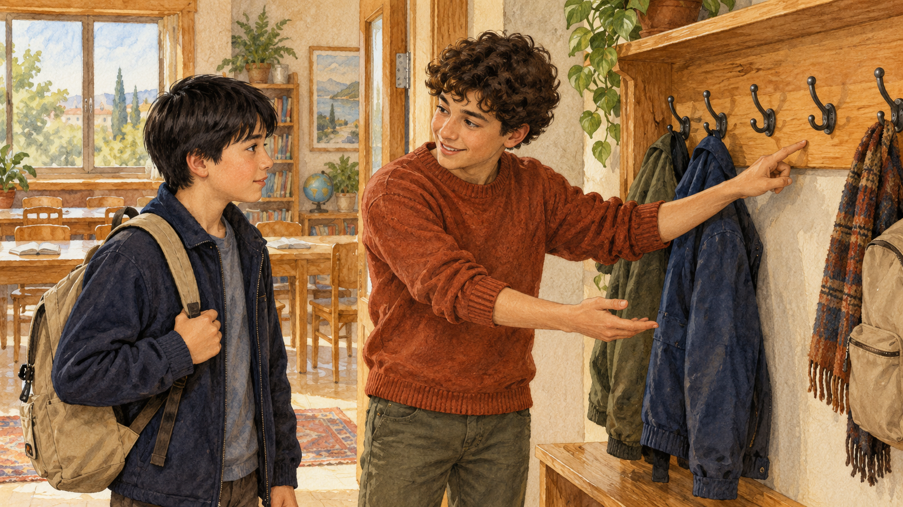

10. Wir probieren es aus

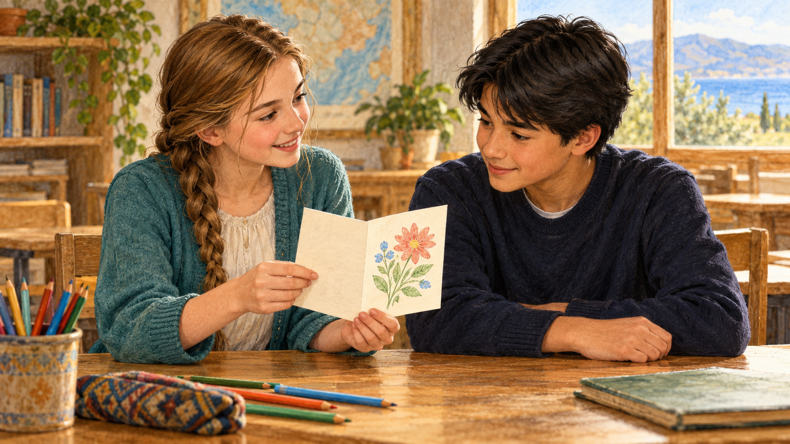

11. Meine kleine gute Tat

12. Mit dem beginnen, was da ist

01. Womit beginnen. Mischa denkt über seine Möglichkeiten nach.

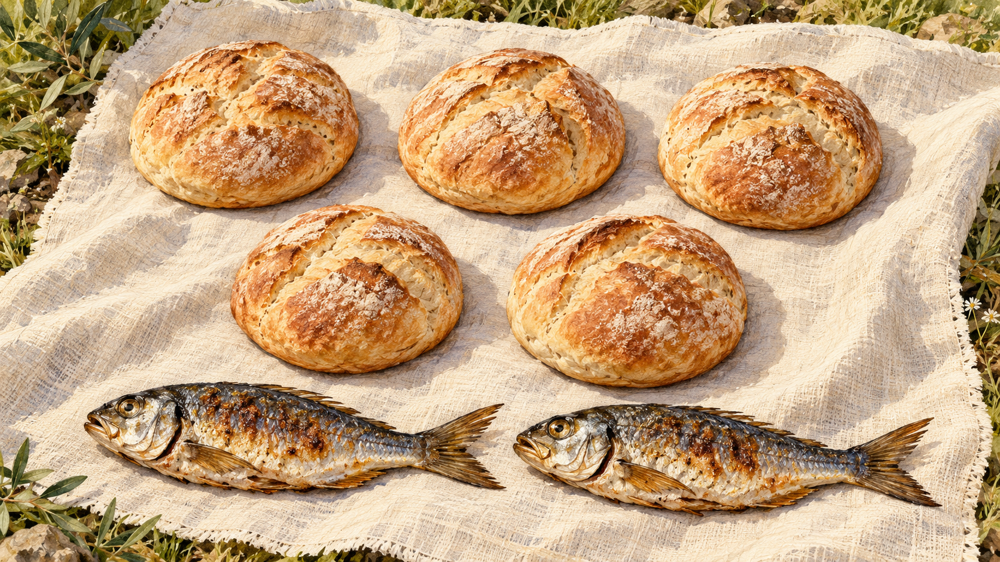

02. Fünf Brote und zwei Fische. Genau fünf einzelne Brote und zwei Fische.

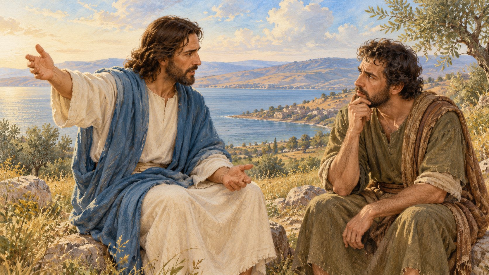

03. Die Frage an Philippus. Christus fragt, wo man Brot für das Volk kaufen kann.

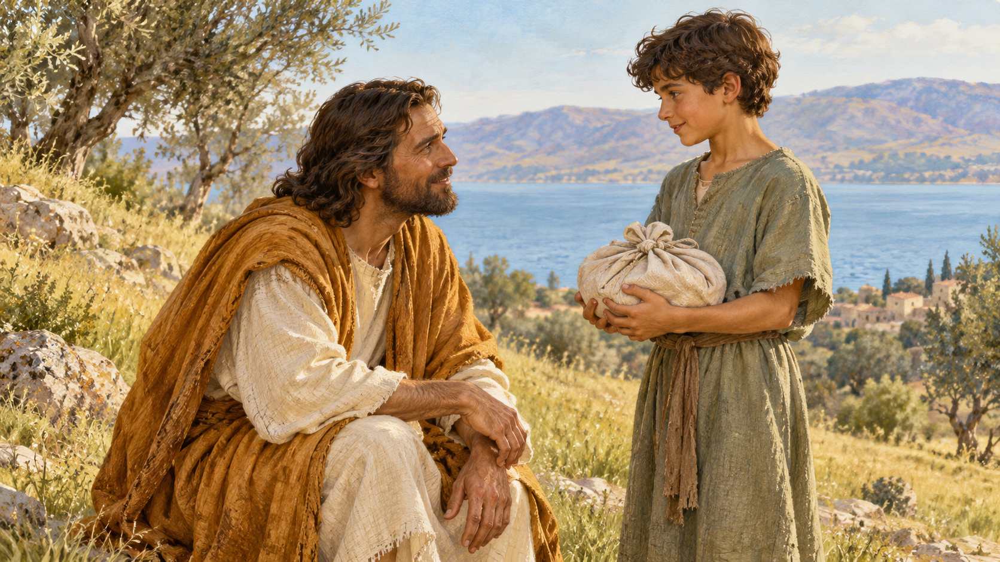

04. Andreas und der Junge. Künstlerische Szene: Was hat der Junge?

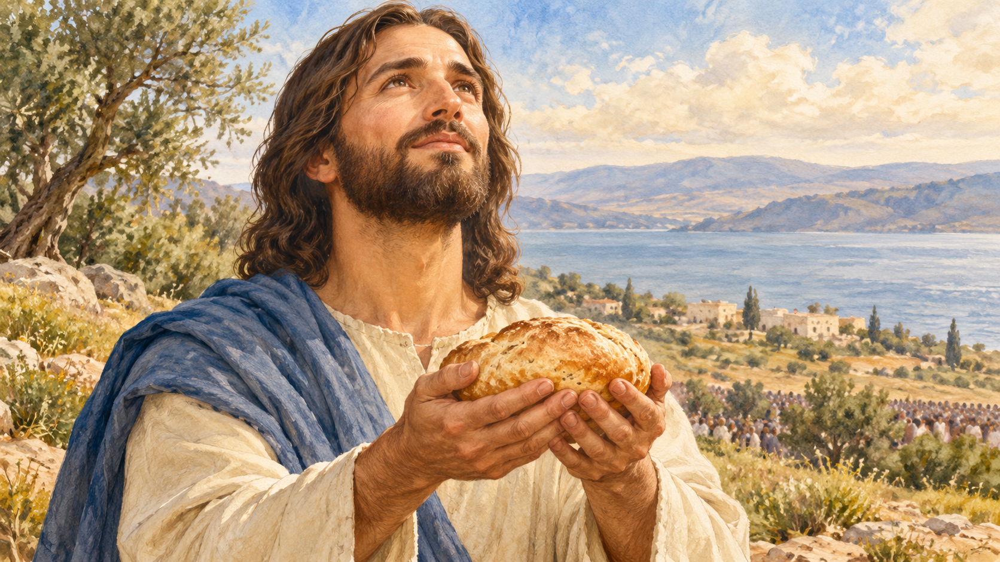

05. Dank. Christus dankt; in der Nahaufnahme ist ein Brot.

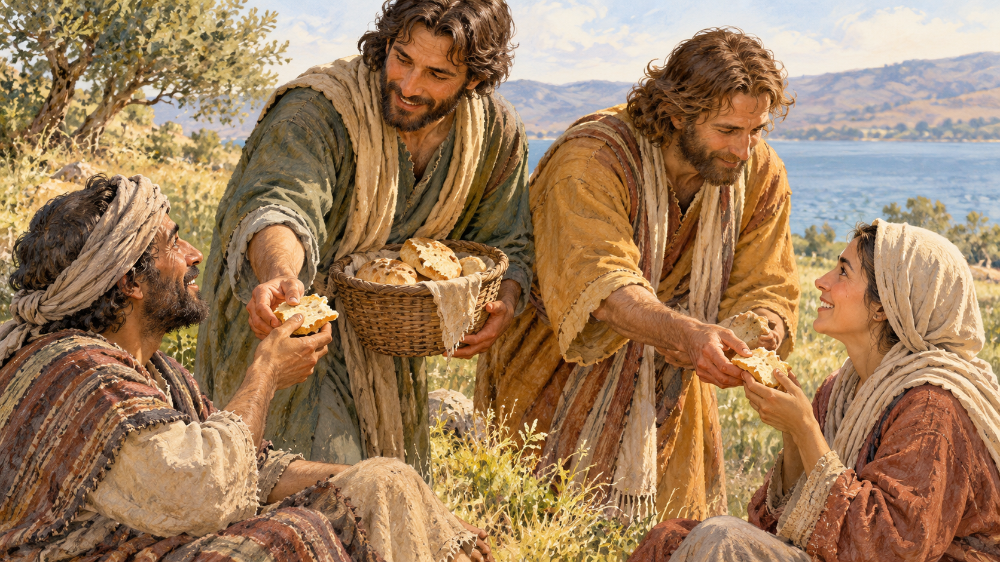

06. Die Jünger teilen aus. Zwei Jünger und zwei Empfänger vertreten eine große Gruppe.

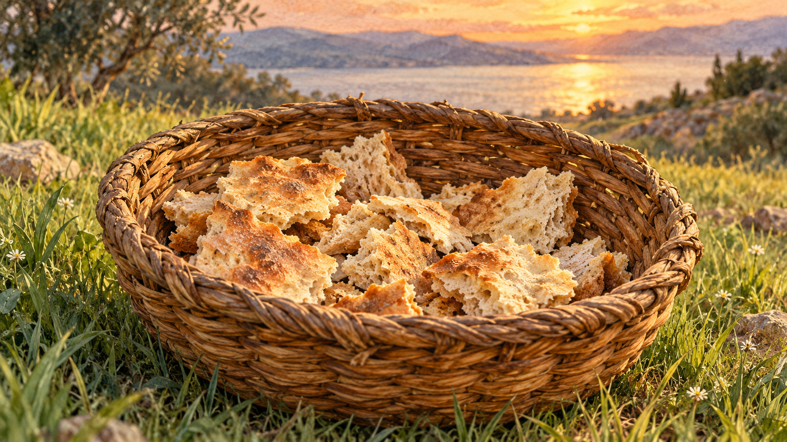

07. Übrige Stücke. Einer von zwölf Körben; die übrigen sind außerhalb des Bilds.

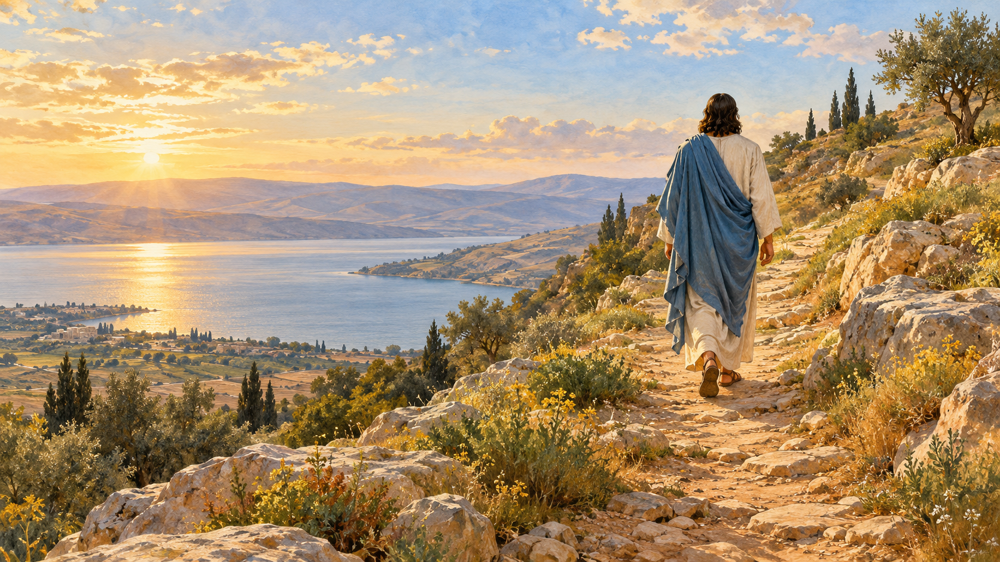

08. Christus zieht sich zurück. Nachdem das Volk ihn zum König machen will, geht Jesus allein weg.

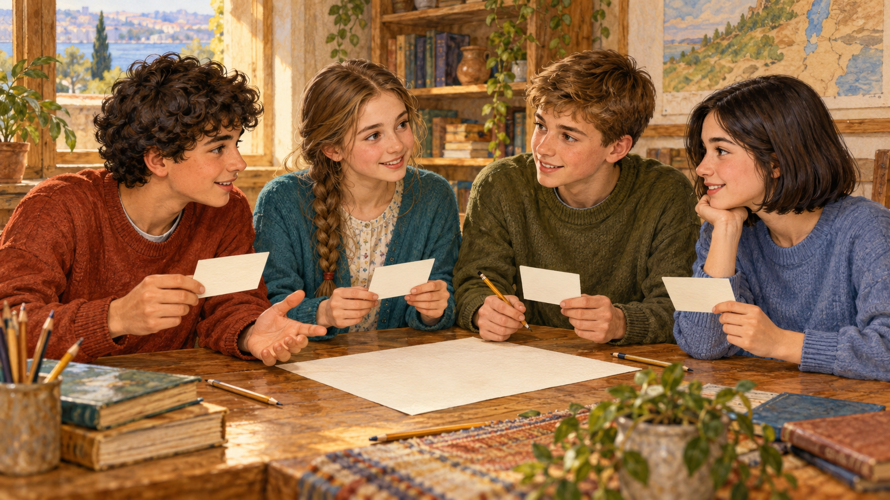

09. Möglichkeiten des Teams. Vier Jugendliche besprechen vier Informationen.

10. Ein neues Mitglied begrüßen. Mischa zeigt Roman den Platz für seine Jacke.

11. Eine Karte ohne viele Worte. Katja zeigt Roman ein kleines Bild.

12. Mein kleiner Schritt. Mischa schreibt eine mögliche Tat auf.

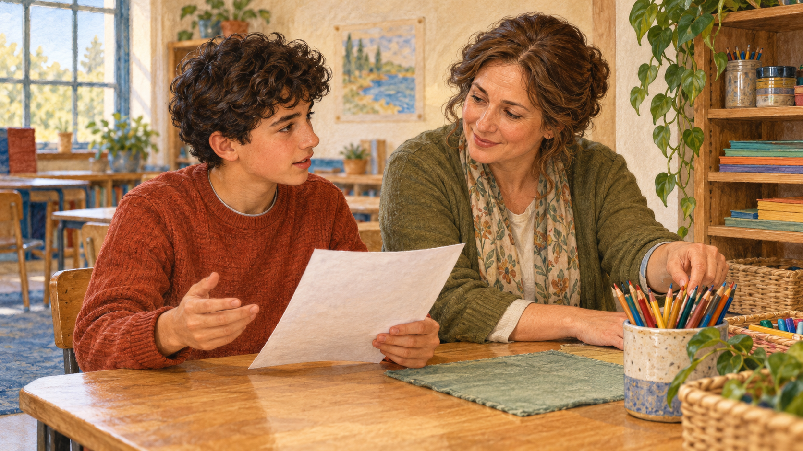

13. Hilfe eines Erwachsenen. Mischa fragt die Lehrkraft, was er benutzen darf.

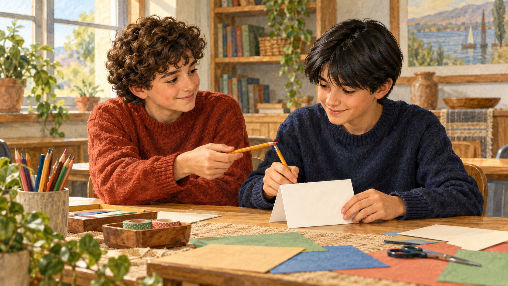

14. Hilfe nebenan. Mischa bietet Roman einen Stift und einen Platz am Tisch an.
